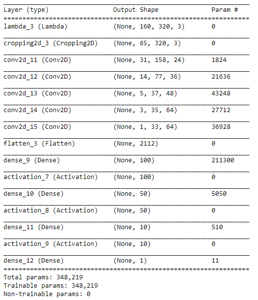

# Udacity Self-Driving Car Engineer Nanodegree - Behavioral Cloning Project

**Note: This project makes use of a Udacity-developed driving simulator and training data collected from the simulator (neither of which is included in this repo).**

---

### Introduction
The objective of this project is to teach the computer to drive car on on the basis of data collected in simulator provided by Udacity [here](.amazonaws.com/video.udacity-data.com/topher/2016/December/584f6edd_data/data.zip). Here we apply the concepts of Deep Learning and Convolutional Neural Networks to teach the computer to drive car autonomously.

We feed the data collected from Simulator to our model, this data is fed in the form of images captured by 3 dashboard cams center, left and right. The output data contains a file data.csv which has the mappings of center, left and right images and the corresponding steering angle, throttle, brake and speed. 

Using Keras Deep learning framework we can create a model.h5 file which we can test later on simulator with the command "python drive.py model.h5". This drive.py connects your model to simulator. The challenge in this project is to collect all sorts of training data so as to train the model to respond correctly in any type of situation.

---

### Files Submitted & Code Quality

#### 1. Submission includes all required files and can be used to run the simulator in autonomous mode

My project includes the following files:
* model.py containing the script to create and train the model
* model.ipynb python notebook containing the code to create and train the model
* drive.py for driving the car in autonomous mode
* model.h5 containing a trained convolution neural network 
* writeup_report.md  summarizing the results

#### 2. Submission includes functional code

Using the Udacity provided simulator and my drive.py file, the car can be driven autonomously around the track by executing 
```sh
python drive.py model.h5
```

#### 3. Submission code is usable and readable

The model.py file contains the code for training and saving the convolution neural network. The file shows the pipeline I used for training and validating the model, and it contains comments to explain how the code works.

---

## Model Architecture and Training Strategy


###  Model Architecture

* I decided to use the model published by NVIDIA. The descreption for NVIDIA model can be found [here](https://images.nvidia.com/content/tegra/automotive/images/2016/solutions/pdf/end-to-end-dl-using-px.pdf). I decided to test same model on our input data with shape (160,320,3)


### Training Data 

I have used the training data provided by Udacity along with some more data collected by using Udacity's Simulator tool. I have used all `center`, `left` and right camera images to train the model. The code for this can be found in the cell number 21.

Correction factor has been added to the steering angles corresponding to the left(+0.2) and right(-0.2) camera images.

Input image looks like below


### Preprocessing

* The pixel values are normalized using following technique
    (x / 255.0) - 0.5
* The camera images are shuffled and then fed to the CNN.
* Data Augmenting: I used `np.flipud()` function to flip the images and negated the corresponding angle values.


### Creation of the Training Set & Validation Set

* The samples are divided into training and validation set using sklearn preprocessing library.
* 20% of the data was set aside for validation.
* The data is being fed to the CNN using `generator()` with batch size 32.

### Final Model Architecture

* Final architecture looks like in the image below



The labda layer applies the normalization followed by 5 convolution layers as shown above.


* 1st convolutional layer with filter depth as 24 and kernel size (5,5) with (2,2) stride followed by `relu` activation function
* 2nd convolutional layer with filter depth as 36 and kernel size (5,5) with (2,2) stride followed by `relu` activation function
* 3rd convolutional layer with filter depth as 48 and kernel size (5,5) with (2,2) stride followed by `relu` activation function
* 4th convolutional layer with filter depth as 64 and kernel size (3,3) with (1,1) stride followed by `relu` activation function
* 5th convolutional layer with filter depth as 64 and kernel size (3,3) with (1,1) stride followed by `relu` activation function
* Next, flatten the outputs
* Next, fully connected layer with 100 outputs
* Followed by fully connected layer with 50 outputs
* Followed by 3rd fully connected layer with 10 outputs
* And finally the layer with one output.


### Attempts to reduce overfitting in the model
Since the model was not overfitting there was no need for dropout.

### Model parameter tuning
The model used an adam optimizer, so the learning rate was not tuned manually.

* No of epochs = 5
* Batch Size = 32
* Correction factor = 0.2
* Loss Function Used- MSE(Mean Squared Error)
 
### Conclusion
The model worked well on the track at all the times, and it was able to drive the car as expected. You can check the video [here](https://github.com/Vinod-Koli/CarND-Behavioral-Cloning/blob/master/run1.mp4)
